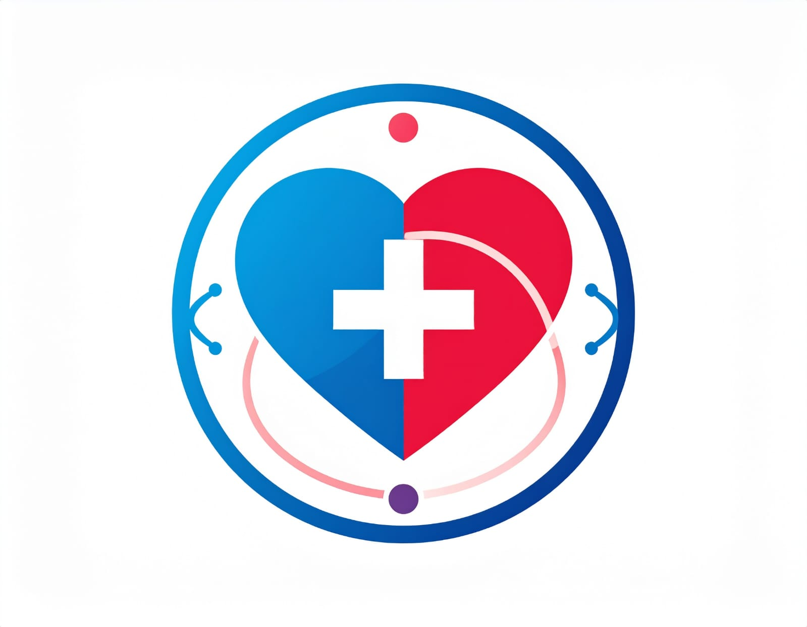

<p align="center">
  
</p>

<h1 align="center">LifeLink — Mobile App (Frontend)</h1>

<p align="center">
  <strong>A React Native / Expo mobile application connecting blood, organ, tissue & stem cell donors with recipients across India.</strong>
</p>

<p align="center">
  
  
  
  
  
</p>

---

## 📖 Overview

**LifeLink** is a cross-platform mobile app built with **Expo** and **React Native** (TypeScript) that acts as a digital bridge between people who want to donate and those who urgently need life-saving donations — blood, organs, tissues, and stem cells.

> *"Connecting donors and recipients across India."*

---

## ✨ Features

- 🔐 **Secure Authentication** — JWT-based login, registration, token refresh
- 🩸 **Donor Registration** — Register as a donor with detailed medical info (blood type, HLA, hemoglobin, BMI, etc.)
- 🏥 **Recipient Registration** — Register a receive request for blood, organ, tissue, or stem cell
- 🤝 **Smart Matching** — AI/ML-powered donor-recipient matching; view match results as donor or recipient
- 📋 **Match Details** — Confirm or reject matches; view detailed donor/recipient profiles
- 📍 **Manual Matching** — Admin/manual match by donation ID and receive request ID
- 📊 **Status Dashboard** — Track donations, receive requests, and match statuses
- 🔔 **Notifications** — In-app notifications for match events and updates
- 👤 **Profile Screen** — View and manage user profile, donation history, follow users
- 🌓 **Dark / Light Mode** — Full theme support
- 📱 **Responsive UI** — Adaptive layouts using `widthPercentageToDP` / `heightPercentageToDP`

---

## 🗂️ App Structure

```
lifelink-frontend/
├── app/
│   ├── index.tsx                    # Landing / home screen
│   ├── (auth)/
│   │   ├── loginScreen.tsx
│   │   └── registerScreen.tsx
│   ├── (tabs)/
│   │   ├── donate.tsx               # Donate hub
│   │   ├── receive.tsx              # Receive hub
│   │   ├── match.tsx                # Match hub
│   │   └── profile.tsx              # Profile tab
│   ├── navigation/
│   │   ├── donorscreens/            # Donor registration & management
│   │   ├── recipientscreens/        # Recipient registration & management
│   │   ├── matchscreens/            # Match results, details, profiles
│   │   ├── statusscreens/           # Donation & request status
│   │   ├── profilescreens/          # User profile
│   │   ├── hubs/                    # Donate / Receive / Match hubs
│   │   └── RaiseFund.tsx            # Fundraising (coming soon)
│   └── api/                         # API clients (donor, recipient, matching, etc.)
├── components/
│   ├── common/                      # Shared UI components
│   ├── donor/                       # Donor-specific components
│   ├── recipient/                   # Recipient-specific components
│   └── match/                       # Match-related components
├── constants/
│   └── styles/                      # Themes, unified styles, auth styles
├── utils/
│   ├── auth-context.tsx             # Auth state management
│   ├── theme-context.tsx            # Dark/light theme context
│   ├── medicalValidation.ts         # Medical field validators
│   └── responsive.ts                # Responsive dimension helpers
└── assets/
    └── images/
```

---

## 🚀 Getting Started

### Prerequisites

- [Node.js](https://nodejs.org/) (v18+)
- [Expo CLI](https://docs.expo.dev/get-started/installation/)
- Android Studio (for Android emulator) or Xcode (for iOS simulator)
- A running instance of the [LifeLink Backend](https://github.com/LifeLink-The-Digital-Bridge/lifelink-server)

### Installation

```bash
# Clone the repository
git clone https://github.com/LifeLink-The-Digital-Bridge/lifelink-frontend.git
cd lifelink-frontend

# Install dependencies
npm install
```

### Running the App

```bash
# Start Expo development server
npx expo start
```

Then open the app in:
- 📱 **Expo Go** — scan the QR code
- 🤖 **Android Emulator** — press `a`
- 🍎 **iOS Simulator** — press `i`
- 🌐 **Web** — press `w`

---

## 🛠️ Tech Stack

| Technology | Purpose |
|---|---|
| **Expo SDK** | Cross-platform build & dev tooling |
| **React Native** | Mobile UI framework |
| **TypeScript** | Type-safe development |
| **Expo Router** | File-based navigation |
| **Expo SecureStore** | Secure JWT token storage |
| **Expo Location** | GPS for recipient registration |
| **React Native Animatable** | Smooth animations |
| **Feather Icons** | Icon set |

---

## 🔗 Backend

This app connects to the **LifeLink Server** (Spring Boot microservices + Python ML service):  
👉 [https://github.com/LifeLink-The-Digital-Bridge/lifelink-server](https://github.com/LifeLink-The-Digital-Bridge/lifelink-server)

---

## 📜 License

This project is licensed under the [MIT License](LICENSE).  
© 2025 AdepuSriCharan